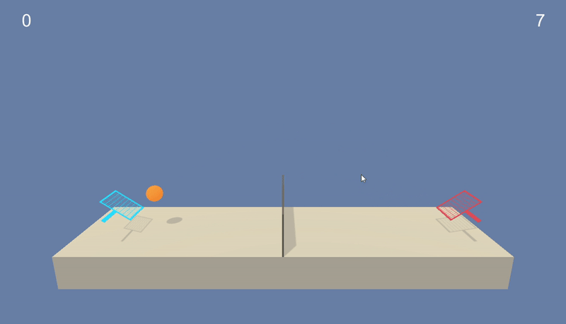
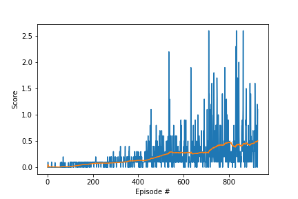
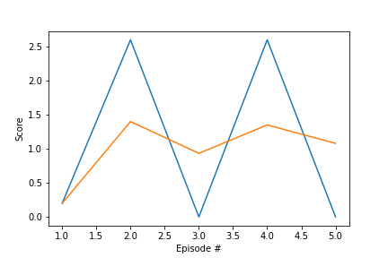

# Report

## Summary

An agent is trained to follow a green mark with the [Reacher](https://github.com/Unity-Technologies/ml-agents/blob/master/docs/Learning-Environment-Examples.md#reacher) environment



In this environment, two agents control rackets to bounce a ball over a net. If an agent hits the ball over the net, it receives a reward of +0.1. If an agent lets a ball hit the ground or hits the ball out of bounds, it receives a reward of -0.01. Thus, the goal of each agent is to keep the ball in play.

The observation space consists of 8 variables corresponding to the position and velocity of the ball and racket. Each agent receives its own, local observation. Two continuous actions are available, corresponding to movement toward (or away from) the net, and jumping.

The task is episodic, and in order to solve the environment, the agents must get an average score of +0.5 (over 100 consecutive episodes, after taking the maximum over both agents). Specifically,

After each episode, we add up the rewards that each agent received (without discounting), to get a score for each agent. This yields 2 (potentially different) scores. We then take the maximum of these 2 scores.
This yields a single score for each episode.
The environment is considered solved, when the average (over 100 episodes) of those scores is at least +0.5.

## Implementation

DDPG algorithm is based on Actor-Critic method. 


Actor and Critic have two network each, local and target for stable learning. It uses a replay buffer to store experience and samples them for learning. After certain steps, Critic local network in evaluated and trained using target network of Actor and Critic. The trained critic is used to get an actor loss adn train the Actor. In the end of the learning step it updates the target networks weights with the local network weights.

Ornstein-Uhlenbeck process provide us with the noise that is add to action for better exploration.


### Model Configuration
#### Actor
| Layer | In | Out
| ----------- | ----------- |----------- |
| Fc1 | state_size | 128
| ReLU | - | -
| Fc2 | 128 | 128
| ReLU | - | -
| Fc3 | 128 | action_size
| tanh | action_size | action_size

#### Critic
| Layer | In | Out
| ----------- | ----------- |----------- |
| Fc1 | state_size | 128
| ReLU | - | -
| Fc2 | 128 + action_size | 128
| ReLU | - | -
| Fc3 | 128 | 1


## Observations

For this environment, the exploration is very important with the use of Noise. Training took very long time at first few days. With proper noise the agent has achieved the score with in 30 min.

## Results
### hyperparameter
```python
    'buffer_size' : int(1e5),  # replay buffer size
    'batch_size' : 512,        # minibatch size
    'gamma' : 0.99,            # discount factor
    'tau' : 2e-1,              # for soft update of target parameters
    'lr_actor' : 1e-4,         # learning rate of the actor 
    'lr_critic' : 3e-4,        # learning rate of the critic
    'weight_decay' : 0,        # L2 weight decay
    'update_every' : 1,        # update the network after every UPDATE_EVERY timestep
    'update_times' : 1,        # update UPDATE_TIME for every update
    'epsilon' : 1,             # epsilon noise parameter
    'epsilon_decay' : 0,       # decay parameter of epsilon
    'OUNoise':{'mu':0,'theta':0.15,'sigma':0.2}
```

### Training 


### Evaluation 


## Future Work
For further improvement following fields could be investigated.

* Noise sampling can be improved 
* [PPO](https://arxiv.org/pdf/1707.06347.pdf), [A3C](https://arxiv.org/pdf/1602.01783.pdf), and [D4PG](https://openreview.net/pdf?id=SyZipzbCb) can be used to check for performance improvement.


## Reference

An Autonomous Path Planning Model for Unmanned Ships Based on Deep Reinforcement Learning - Scientific Figure on ResearchGate. Available from: https://www.researchgate.net/figure/Deep-Deterministic-Policy-Gradient-DDPG-algorithm-structure_fig3_338552761 [accessed 12 Jul, 2020]